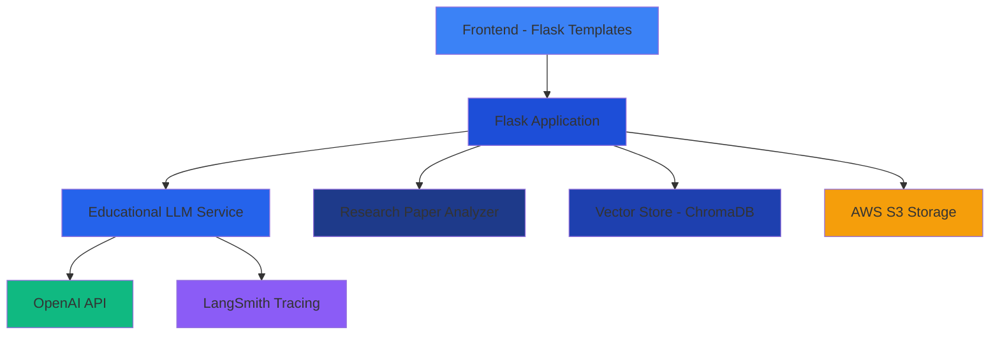

# 🧠 Research Paper Assistant

<div align="center">


*An AI-powered knowledge management system designed specifically for academic research and paper analysis*

[🚀 Live Demo](#) • [📖 Documentation](#features) • [🐛 Report Bug](https://github.com/rashmithahansamal/RAG-KMS/issues) • [💡 Request Feature](https://github.com/rashmithahansamal/RAG-KMS/issues)

</div>

---

## 🌟 Overview

Research Paper Assistant is a sophisticated RAG (Retrieval-Augmented Generation) powered knowledge management system that transforms how researchers interact with academic literature. Built with modern web technologies and AI capabilities, it provides intelligent document analysis, summarization, and methodology extraction specifically tailored for educational and research purposes.

## ✨ Features

### 🤖 **Intelligent Q&A Bot**
- **Smart Document Querying**: Ask natural language questions about uploaded research papers
- **Context-Aware Responses**: Get precise answers with source citations
- **Educational Focus**: Responses tailored for academic learning and understanding

### 📄 **Research Paper Summarizer**
- **Comprehensive Summaries**: Generate structured academic summaries
- **Key Insights Extraction**: Identify research objectives, methodologies, and findings
- **Educational Context**: Summaries designed to help students understand research contributions

### 🔬 **Methodology Extraction**
- **Research Design Analysis**: Automatic identification of research methodologies
- **Data Collection Methods**: Extract and explain data gathering techniques
- **Statistical Analysis**: Understand analytical approaches and limitations
- **Educational Insights**: Learn from established research practices

### 🎨 **Modern User Interface**
- **Glassmorphism Design**: Beautiful, modern UI with blur effects and gradients
- **Dark Blue Theme**: Professional color scheme optimized for academic work
- **Responsive Layout**: Works seamlessly across desktop, tablet, and mobile devices
- **Intuitive Navigation**: Easy switching between different analysis tools

### ☁️ **Cloud Infrastructure**
- **AWS S3 Integration**: Secure document storage and retrieval
- **Vector Database**: ChromaDB for intelligent document similarity search
- **Scalable Architecture**: Designed for high-performance document processing

## 🏗️ Architecture



## 🚀 Quick Start

### Prerequisites

- Python 3.8+
- Docker (optional)
- OpenAI API Key
- AWS Account (for S3 storage)

### 🔧 Installation

1. **Clone the repository**
   ```bash
   git clone https://github.com/rashmithahansamal/RAG-KMS.git
   cd RAG-KMS
   ```

2. **Create virtual environment**
   ```bash
   python -m venv venv
   source venv/bin/activate  # On Windows: venv\Scripts\activate
   ```

3. **Install dependencies**
   ```bash
   pip install -r requirements.txt
   ```

4. **Environment Configuration**
   ```bash
   cp .env.example .env
   # Edit .env with your API keys and configuration
   ```

5. **Run the application**
   ```bash
   python app/main.py
   ```

6. **Access the application**
   ```
   Open your browser and navigate to: http://localhost:8080
   ```

### 🐳 Docker Deployment

```bash
# Build the image
docker build -t research-paper-assistant .

# Run the container
docker run -d -p 8080:8080 \
  -e OPENAI_API_KEY="your-openai-key" \
  -e AWS_ACCESS_KEY_ID="your-aws-access-key" \
  -e AWS_SECRET_ACCESS_KEY="your-aws-secret-key" \
  -e AWS_BUCKET_NAME="your-s3-bucket" \
  research-paper-assistant
```

## 📁 Project Structure

```
RAG-KMS/
├── 📁 app/
│   ├── 📄 main.py                 # Flask application entry point
│   ├── 📄 config.py               # Configuration management
│   ├── 📁 models/
│   │   └── 📄 vector_store.py     # ChromaDB vector store implementation
│   ├── 📁 services/
│   │   ├── 📄 Q_bot.py            # Educational LLM service
│   │   ├── 📄 researchpanalysis.py # Research paper analyzer
│   │   ├── 📄 llm_service.py      # LLM service interface
│   │   └── 📄 storage_service.py  # AWS S3 storage service
│   ├── 📁 templates/
│   │   ├── 📄 index.html          # Quiz Bot landing page
│   │   ├── 📄 summarizer.html     # Research paper summarizer
│   │   └── 📄 methodology.html    # Methodology extraction
│   └── 📁 static/
│       └── 📄 style.css           # Modern UI styling
├── 📁 .github/workflows/
│   └── 📄 cicd.yaml               # CI/CD pipeline
├── 📁 vector_db/                  # ChromaDB storage
├── 📄 Dockerfile                  # Container configuration
├── 📄 requirements.txt            # Python dependencies
└── 📄 README.md                   # This file
```

## 🔧 Configuration

### Environment Variables

Create a `.env` file with the following variables:

```env
# OpenAI Configuration
OPENAI_API_KEY=your-openai-api-key

# AWS Configuration
AWS_ACCESS_KEY_ID=your-aws-access-key
AWS_SECRET_ACCESS_KEY=your-aws-secret-key
AWS_REGION=your-aws-region
AWS_BUCKET_NAME=your-s3-bucket-name

# LangSmith Configuration (Optional)
LANGSMITH_API_KEY=your-langsmith-api-key
LANGSMITH_TRACING=true
LANGSMITH_ENDPOINT=https://api.smith.langchain.com
LANGSMITH_PROJECT=rag-kms-project

# Vector Database
VECTOR_DB_PATH=vector_db
```

## 🎯 Usage Guide

### 1. **Upload Documents**
- Navigate to any analysis page
- Drag and drop PDF research papers
- Wait for processing confirmation

### 2. **Ask Questions (Quiz Bot)**
- Go to the main page
- Type natural language questions about your documents
- Get intelligent, context-aware responses

### 3. **Generate Summaries**
- Use the Research Paper Summarizer
- Fill in paper metadata (title, authors, journal)
- Get comprehensive academic summaries

### 4. **Extract Methodology**
- Access the Extract Methodology page
- Upload research papers
- Receive detailed methodology breakdowns

## 🛠️ Technology Stack

### **Backend**
-  **Python 3.8+**
-  **Flask** - Web framework
-  **LangChain** - Document processing
-  **OpenAI API** - Language model

### **Database & Storage**
-  **ChromaDB** - Vector database
-  **AWS S3** - Document storage

### **Frontend**
-  **HTML5**
-  **CSS3** - Modern glassmorphism design
-  **Vanilla JavaScript**

### **DevOps**
-  **Docker** - Containerization
-  **GitHub Actions** - CI/CD
-  **AWS ECR** - Container registry

## 🚀 Deployment

### **CI/CD Pipeline**

The project includes a complete CI/CD pipeline using GitHub Actions:

1. **Continuous Integration**
   - Code linting and validation
   - Unit testing
   - Security scanning

2. **Continuous Delivery**
   - Docker image building
   - Push to AWS ECR
   - Automated deployment

3. **Production Deployment**
   - Self-hosted runner deployment
   - Environment variable injection
   - Health monitoring

### **Manual Deployment**

```bash
# Build and deploy using Docker
docker build -t research-paper-assistant .
docker run -d -p 8080:8080 --env-file .env research-paper-assistant
```

## 🧪 Testing

```bash
# Run unit tests
python -m pytest tests/

# Run integration tests
python -m pytest tests/integration/

# Check code quality
flake8 app/
black app/ --check
```

## 🤝 Contributing

We welcome contributions! Please see our [Contributing Guidelines](CONTRIBUTING.md) for details.

### **Development Workflow**

1. Fork the repository
2. Create a feature branch (`git checkout -b feature/amazing-feature`)
3. Make your changes
4. Add tests for new functionality
5. Commit your changes (`git commit -m 'Add amazing feature'`)
6. Push to the branch (`git push origin feature/amazing-feature`)
7. Open a Pull Request

## 📄 License

This project is licensed under the MIT License - see the [LICENSE](LICENSE) file for details.

## 🙏 Acknowledgments

- **OpenAI** for providing powerful language models
- **LangChain** for excellent document processing capabilities
- **ChromaDB** for efficient vector storage and retrieval
- **AWS** for reliable cloud infrastructure
- **Flask** community for the excellent web framework

## 📞 Support

- 📧 **Email**: [your-email@example.com](mailto:your-email@example.com)
- 🐛 **Issues**: [GitHub Issues](https://github.com/rashmithahansamal/RAG-KMS/issues)
- 💬 **Discussions**: [GitHub Discussions](https://github.com/rashmithahansamal/RAG-KMS/discussions)

## 🗺️ Roadmap

- [ ] **Multi-language Support** - Support for research papers in multiple languages
- [ ] **Advanced Analytics** - Research trend analysis and insights
- [ ] **Collaboration Features** - Team workspaces and shared documents
- [ ] **API Development** - RESTful API for external integrations
- [ ] **Mobile App** - Native mobile applications
- [ ] **Advanced Search** - Semantic search across document collections

---

<div align="center">

**Built with ❤️ for the academic research community**

[](https://www.python.org/)
[](https://openai.com/)
[](https://aws.amazon.com/)

⭐ **Star this repository if you found it helpful!**

</div>